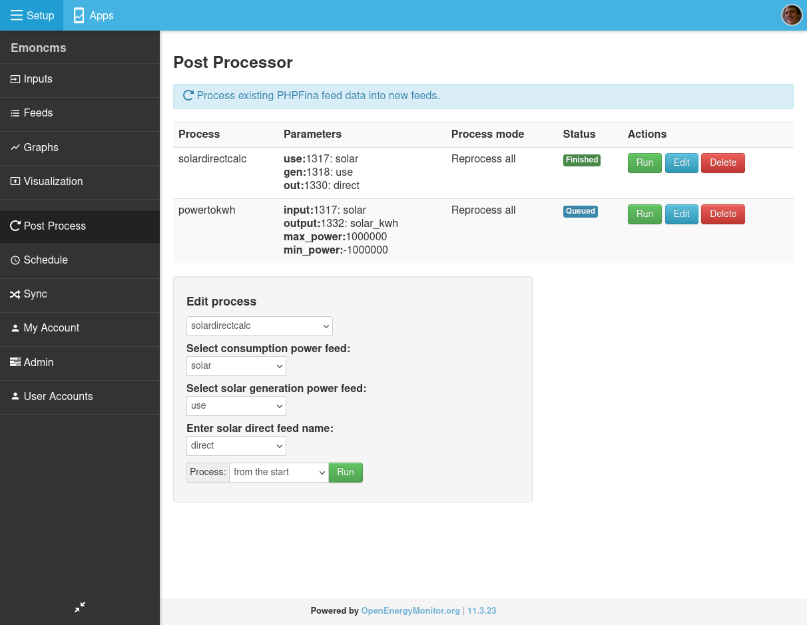

# Post processing module for emoncms

Rather than process inputs as data arrives in emoncms such as calculating cumulative kWh data from power data with the power to kWh input process, this module can be used to do these kind of processing steps after having recorded base data such as power data for some time. This removes the reliance on setting up everything right in the first instance providing the flexibility to recalculate processed feeds at a later date.

### EmonPi, Emonbase install

Install the postprocess module in /opt/emoncms/modules:

    cd /opt/emoncms/modules
    git clone https://github.com/emoncms/postprocess.git

Symlink the web part of the postprocess module into emoncms/Modules:

    ln -s /opt/emoncms/modules/postprocess/postprocess-module /var/www/emoncms/Modules/postprocess

The postprocess background script is designed to be ran in the background using service-runner.service.
This is installed by default on the standard emonSD image build.

Alternatively to run manually:

    cd /opt/emoncms/modules/postprocess
    sudo php postprocess_run.php