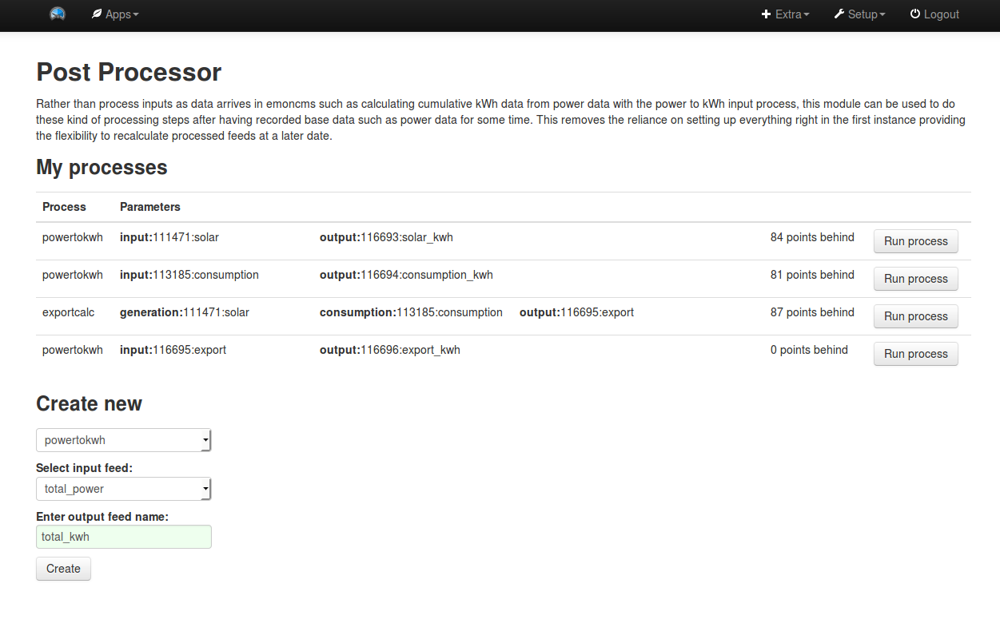

# Post processing module for emoncms

Rather than process inputs as data arrives in emoncms such as calculating cumulative kWh data from power data with the power to kWh input process, this module can be used to do these kind of processing steps after having recorded base data such as power data for some time. This removes the reliance on setting up everything right in the first instance providing the flexibility to recalculate processed feeds at a later date.

